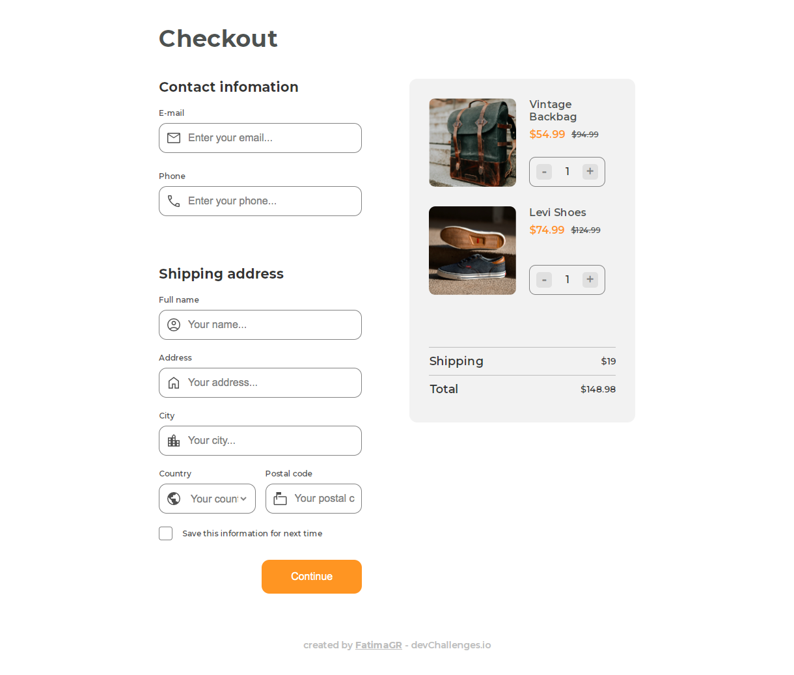

<!-- Please update value in the {}  -->

<h1 align="center">Checkout page</h1>

   Solution for a challenge from  <a href="http://devchallenges.io" target="_blank">Devchallenges.io</a>.

  <h3>
    <a href="https://{your-demo-link.your-domain}">
      Demo
    </a>
     | 
    <a href="https://github.com/FatimaGR/Checkout-page-solution">
      Solution
    </a>
     | 
    <a href="https://devchallenges.io/challenges/0J1NxxGhOUYVqihwegfO">
      Challenge
    </a>
  </h3>

<!-- OVERVIEW -->

## Overview

### The challenge

Create a checkout page following the design. You don’t need to use JS in this challenge but use correct input types and validation. Fulfill user stories below:

- [✓] User story: I can see a page following the given design
- [✓] User story: I can input email, phone, full name, address, city, country, and postal code
- [✓] User story: I can input the number of items
- [✓] User story: I can select at least 3 countries from the dropdown
- [✓] User story: When I click submit button or press enter, I can see a warning if validation fails
- [✓] User story: When I click submit button or press enter, I can see a successful alert if validation succeeds
### Built With

- HTML
- CSS
- JavaScript

<!-- THE CHALLENGE -->
## Contact

- Website - [Fatima Gallardo](https://porfolio-website-gules.vercel.app)
- GitHub - [@FatimaGR](https://github.com/FatimaGR)
- Dev challenges - [@FatimaGR](https://devchallenges.io/portfolio/FatimaGR)
